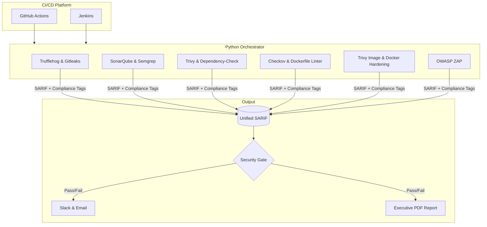

# 🛡️ Enterprise DevSecOps CI/CD Pipeline


A production-grade, end-to-end DevSecOps pipeline orchestrator written in Python. It integrates security scanning into every phase of the Software Development Life Cycle (SDLC), enforcing strict enterprise security gates mapped directly to major financial compliance standards.

---

## 🏗️ Architecture & SARIF Flow

This pipeline utilizes **SARIF v2.1.0** (Static Analysis Results Interchange Format) as the universal source of truth. Instead of managing 10+ custom JSON outputs, every security tool runner instantly normalizes its findings into SARIF and enriches them with Compliance Tags before handing off to the centralized Security Gate.



---

## 🔍 Pipeline Stages & Tool Stack

| Stage | Security Tools | Purpose | Compliance Focus |
|-------|----------------|---------|------------------|
| **Secrets** | Trufflehog, Gitleaks | Detect hardcoded API keys, passwords, and tokens | PCI-DSS 3.4 (PAN encryption), SOC 2 CC6.1 |
| **SAST** | SonarQube, Semgrep | White-box analysis of source code for OWASP Top 10 | PCI-DSS 6.5 (Custom code review) |
| **SCA** | OWASP Dependency-Check, Trivy | Detect CVEs in open-source libraries + Generate SBOM | PCI-DSS 6.2 (Security Patches) |
| **IaC** | Checkov, Custom Docker Linter | Scan Dockerfile and Terraform for misconfigurations | ISO 27001 A.8.2 (Privileges) |
| **Container** | Trivy, Docker Hardening | Scan base images and enforce CIS Docker benchmarks | SOC 2 CC7.1 (Infrastructure) |
| **DAST** | OWASP ZAP | Black-box dynamic testing of the running target API | PCI-DSS 6.5.1 (Injection testing) |

---

## 🛑 Security Gate Logic

The pipeline does not just "log" issues; it actively enforces security. The Python Security Gate (`pipeline_stages/gates/security_gate.py`) evaluates the unified SARIF payload against `gate_config.json`:

1. **Severity Thresholds**: Fails the build if any `CRITICAL` vulnerability is found, or if `HIGH` vulnerabilities exceed the defined threshold.
2. **CVSS Blocking**: Automatically blocks any finding with a CVSS v3 score ≥ 9.0.
3. **Hardcoded Secrets**: Fails instantly if a verified secret is detected in the source code.
4. **Compliance Enforcement**: Maps every CWE to PCI-DSS, ISO 27001, and SOC 2. If an enforced compliance control is violated by a High/Critical finding, the build is blocked.

### Example Gate Evaluation
```text
┌─────────────┬──────────┬──────┬────────┬─────┬──────────────────────┬─────────┐
│ Stage       │ Critical │ High │ Medium │ Low │ Compliance           │ Gate    │
├─────────────┼──────────┼──────┼────────┼─────┼──────────────────────┼─────────┤
│ SAST        │ 2        │ 2    │ 0      │ 0   │ PCI-DSS, ISO-27001   │ ❌ FAIL │
│ SCA         │ 3        │ 1    │ 0      │ 0   │ PCI-DSS, ISO-27001   │ ❌ FAIL │
│ SECRETS     │ 2        │ 1    │ 0      │ 0   │ PCI-DSS, ISO-27001   │ ❌ FAIL │
│ IAC         │ 1        │ 1    │ 2      │ 0   │ PCI-DSS, ISO-27001   │ ❌ FAIL │
│ CONTAINER   │ 1        │ 1    │ 0      │ 0   │ PCI-DSS, ISO-27001   │ ❌ FAIL │
│ DAST        │ 0        │ 1    │ 1      │ 1   │ PCI-DSS, ISO-27001   │ ❌ FAIL │
├─────────────┼──────────┼──────┼────────┼─────┼──────────────────────┼─────────┤
│ TOTAL       │ 9        │ 7    │ 3      │ 1   │ PCI-DSS, ISO-27001   │ ❌ FAIL │
└─────────────┴──────────┴──────┴────────┴─────┴──────────────────────┴─────────┘
```

---

## 🚀 Quick Start

### Prerequisites
- Docker & Docker Compose (with at least 4GB RAM allocated)
- Python 3.11+
- Java 17 & Maven

### 1. Automated Setup
Run the setup script to install Python dependencies, spin up the Docker infrastructure (Jenkins, SonarQube, ZAP, and the vulnerable Target App), and configure the environment:
```bash
./scripts/setup.sh
```

### 2. Run the Full Orchestrator
Execute the complete pipeline against your source code:
```bash
python scripts/orchestrator.py --source . --target http://localhost:8081 --image finsecure:latest --report --notify
```

### 3. Run in Mock Mode (Evaluate sample findings)
Test the Security Gate, Report Generator, and Notifiers without waiting for scans:
```bash
python scripts/orchestrator.py --findings-only --report
```

---

## 🔐 Enterprise Secrets Management

The pipeline abstracts all secret retrieval through `vault_client.py`. Depending on `gate_config.json`, the orchestrator seamlessly fetches credentials (like Slack webhooks or SMTP configs) from:
- HashiCorp Vault (KV v2)
- Jenkins Credentials Provider
- Local environment variables (fallback for local dev)

---

## 📄 Reporting & Notifications

Upon pipeline completion (or failure), the Orchestrator:
1. Pushes SARIF artifacts to GitHub's native Security Tab (if running in Actions).
2. Generates an executive-level HTML/PDF report featuring an **OWASP Top 10 Heatmap** and **Compliance Violation Trackers**.
3. Fires a Slack notification using Block Kit, detailing exactly which compliance standards failed.
4. Emails the security team with the PDF attached.

---

*This project was developed as a portfolio piece to demonstrate advanced DevSecOps engineering, security orchestration, and regulatory compliance mapping.*
