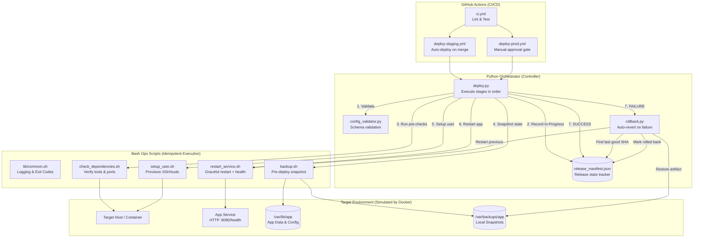

# Architecture — Infrastructure Automation Pipeline

## Overview

This project replaces manual server provisioning with version-controlled, idempotent automation scripts, orchestrated by Python, and wired into GitHub Actions CI/CD. 

If a deployment fails, the pipeline automatically triggers a rollback to the last known-good release using an atomic release manifest.

---

## Data Flow Diagram

---

## Component Roles

### 1. Bash (Execution Layer)
The actual work is done by Bash scripts because they map directly to Linux host operations (systemd, useradd, apt-get, tar). 
- **Idempotency:** Every script tracks its state. If the desired state is already met, the script exits cleanly with code `2` (`ALREADY_DONE`), avoiding redundant work.
- **Safety:** Powered by `set -euo pipefail` and structured logging from `lib/common.sh`.

### 2. Python (Orchestration Layer)
Bash is bad at complex data structures (JSON parsing, strict config validation, API calls). Python handles the high-level logic:
- **`config_validator.py`**: Ensures `.env` files meet the schema (no missing fields, no `CHANGEME` passwords) *before* touching the server.
- **`deploy.py`**: Runs the Bash scripts in order, captures their stdout/stderr, handles timeouts, and determines overall success.
- **`rollback.py`**: If `deploy.py` fails, this script is invoked automatically. It looks up the last successful release and restores it.
- **`release_tracker.py`**: Maintains the atomic JSON manifest of what is deployed.

### 3. GitHub Actions (CI/CD Layer)
- **`ci.yml`**: Runs `shellcheck`, `ruff`, `flake8`, `pytest`, and `bats` tests.
- **`deploy-staging.yml`**: Triggers automatically on merge to `main`.
- **`deploy-prod.yml`**: Triggers manually, supports GitHub Environment protection rules (manual approval).

---

## The Rollback Mechanism

How automatic rollback works:
1. `deploy.py` starts and records a `IN_PROGRESS` release in `release_manifest.json` for SHA `abc123`.
2. Step 4 (`backup.sh`) creates a timestamped archive of `/var/lib/app` tagged with `abc123`.
3. Step 6 (`restart_service.sh`) starts the new code, but the `/health` endpoint fails to return `200 OK` within 30 seconds.
4. `deploy.py` catches the failure, logs it, and marks the manifest as `FAILED`.
5. `deploy.py` automatically invokes `rollback.py`.
6. `rollback.py` queries the manifest: "What was the last `SUCCESS` deployment?" (Answer: SHA `def456`).
7. `rollback.py` unpacks the backup archive for `def456` and restarts the service.
8. If the health check passes, the manifest is marked `ROLLBACK_OK`. The system is stable again.

---

## Design Decisions & Tradeoffs

### Why not just use Ansible / Terraform?
In a real enterprise environment, you *should* use Ansible for host configuration and Terraform for infrastructure provisioning. 
However, config management tools abstract away the underlying mechanics. This project explicitly uses Bash and Python to **demonstrate a deep understanding of what those tools are actually doing under the hood**:
- State detection (idempotency checks)
- Graceful degradation and rollback paths
- POSIX exit codes and POSIX signals
- Data validation and release tracking

### Why Bash for host ops vs. pure Python?
Python requires dependencies (like `pip install requests`) and sometimes compiling native extensions. Bash is guaranteed to exist on almost any Linux target. We push the complex logic to the CI runner (Python) and execute simple, robust Bash commands on the target host.

### Why Python for orchestration vs. pure GitHub Actions YAML?
You can write deployment logic in YAML, but it becomes unreadable, impossible to test locally, and heavily vendor-locked to GitHub. By writing the deploy orchestrator in Python, the logic can be executed locally on a developer's laptop, tested with `pytest`, and easily migrated to GitLab CI or Jenkins if needed.
