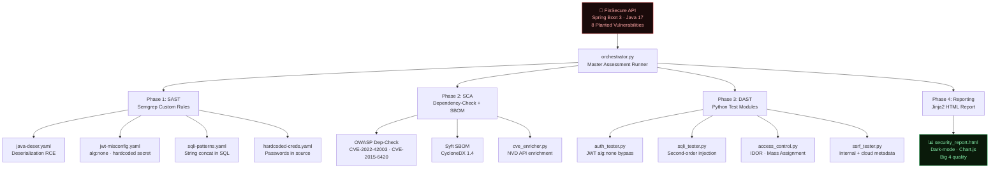

<div align="center">

# 🔐 Java Enterprise App Security Assessment

### End-to-End Penetration Test of a Spring Boot Financial REST API

[](https://openjdk.org/projects/jdk/17/)
[](https://spring.io/projects/spring-boot)
[](https://python.org)
[](https://semgrep.dev)
[](https://owasp.org/Top10/)

> **A complete, production-quality security assessment of a vulnerable Spring Boot financial API — covering SAST, SCA, DAST, and professional report generation. Built to demonstrate real AppSec engineering skills.**

</div>

---

## 📋 One-Line Summary

A full-stack security assessment of **FinSecure API** — a purposely vulnerable Spring Boot 3 financial REST application — using custom Semgrep SAST rules, OWASP Dependency-Check SCA, Python DAST automation, and an interactive dark-mode HTML penetration test report.

---

## 🏗️ Architecture



---

## 🔍 Findings — 12 Documented Vulnerabilities

| ID | Vulnerability | CVSS | Severity | OWASP Category |
|----|--------------|------|----------|----------------|
| FIND-001 | Second-Order SQL Injection in `/api/accounts/search` | **9.8** | 🔴 CRITICAL | A03:2021 - Injection |
| FIND-009 | Spring4Shell RCE — CVE-2022-22965 | **9.8** | 🔴 CRITICAL | A06:2021 - Vuln Components |
| FIND-002 | JWT Algorithm Confusion (alg:none bypass) | **9.1** | 🔴 CRITICAL | A02:2021 - Crypto Failures |
| FIND-008 | Commons Collections Deser RCE — CVE-2015-6420 | **7.5** | 🔴 CRITICAL | A06:2021 - Vuln Components |
| FIND-005 | Mass Assignment — Admin Flag Injection | **8.8** | 🟠 HIGH | A08:2021 - Software Integrity |
| FIND-003 | Horizontal IDOR — Cross-User Account Access | **8.1** | 🟠 HIGH | A01:2021 - Broken Access Ctrl |
| FIND-007 | Jackson Databind CVE-2022-42003 (DoS) | **7.5** | 🟠 HIGH | A06:2021 - Vuln Components |
| FIND-004 | Hardcoded JWT Secret `secret123` | **7.5** | 🟠 HIGH | A07:2021 - Auth Failures |
| FIND-006 | SSRF via `/api/fetch?url=` | **7.2** | 🟠 HIGH | A10:2021 - SSRF |
| FIND-010 | JWT Token Without Expiration | **6.5** | 🟡 MEDIUM | A07:2021 - Auth Failures |
| FIND-011 | Wildcard CORS Misconfiguration | **6.1** | 🟡 MEDIUM | A05:2021 - Misconfig |
| FIND-012 | Verbose Stack Trace Disclosure | **5.3** | 🟡 MEDIUM | A05:2021 - Misconfig |

**Risk Summary: 4 Critical · 5 High · 3 Medium · 0 Low**

---

## 🔬 Methodology

```
┌─────────────────────────────────────────────────────────────────┐
│  PHASE 1: SAST — Static Application Security Testing           │
│  Tool: Semgrep + 4 custom Java rules                           │
│  Detects: Hardcoded creds, JWT flaws, SQLi patterns, Deser RCE │
└────────────────────┬────────────────────────────────────────────┘
                     ▼
┌─────────────────────────────────────────────────────────────────┐
│  PHASE 2: SCA — Software Composition Analysis                  │
│  Tools: OWASP Dependency-Check, Syft (CycloneDX SBOM)         │
│  Detects: CVE-2022-42003, CVE-2015-6420, CVE-2022-22965       │
└────────────────────┬────────────────────────────────────────────┘
                     ▼
┌─────────────────────────────────────────────────────────────────┐
│  PHASE 3: DAST — Dynamic Application Security Testing          │
│  Custom Python scripts: auth_tester, sqli_tester, access_ctrl  │
│  Detects: alg:none bypass, Second-order SQLi, IDOR, SSRF       │
└────────────────────┬────────────────────────────────────────────┘
                     ▼
┌─────────────────────────────────────────────────────────────────┐
│  PHASE 4: REPORTING — Professional Penetration Test Report     │
│  Tool: Custom Jinja2 + Chart.js renderer                       │
│  Output: Interactive dark-mode HTML with CVSS gauges, heatmap  │
└─────────────────────────────────────────────────────────────────┘
```

---

## 🛠️ Tools & Versions

| Phase | Tool | Version | Purpose |
|-------|------|---------|---------|
| Target | Spring Boot | 2.6.3 | Vulnerable financial REST API |
| Target | Java | 17.0.18 | Runtime |
| SAST | Semgrep | 1.x | Custom Java security rules |
| SAST | SonarQube | Community | Code quality + security |
| SCA | OWASP Dependency-Check | 10.0.2 | CVE scanning of `pom.xml` |
| SCA | Syft | Latest | CycloneDX 1.4 SBOM generation |
| SCA | NVD API | v2.0 | CVE enrichment |
| DAST | Custom Python | 3.10+ | Auth, SQLi, IDOR, SSRF testing |
| Report | Jinja2 + Chart.js | 4.4.2 | Interactive HTML report |
| Container | Docker | Latest | SonarQube + API deployment |

---

## 🚀 Setup (5 Commands)

```bash
# 1. Build the vulnerable API
cd "Java Enterprise App Security Assessment/target-app"
mvn clean package -DskipTests

# 2. Start the API
java -jar target/finsecure-api-1.0.0.jar

# 3. Install Python dependencies
pip install semgrep jinja2 requests rich

# 4. Run the full assessment
python orchestrator.py --target http://localhost:8080 --source target-app/src

# 5. Open the report
start report/output/security_report.html
```

### Tool Setup

```bash
# SonarQube via Docker
docker run -d --name sonarqube -p 9000:9000 -e SONAR_ES_BOOTSTRAP_CHECKS_DISABLE=true sonarqube:community

# OWASP Dependency-Check
Invoke-WebRequest "https://github.com/jeremylong/DependencyCheck/releases/download/v10.0.2/dependency-check-10.0.2-release.zip" -OutFile "$HOME\dc.zip"
Expand-Archive "$HOME\dc.zip" -DestinationPath "$HOME\Tools\dependency-check" -Force

# Syft (SBOM)
winget install anchore.syft
```

---

## 📁 Project Structure

```
Java Enterprise App Security Assessment/
├── target-app/                  ← Vulnerable Spring Boot 3 API (Java 17)
│   ├── src/main/java/com/finsecure/
│   │   ├── controller/          ← AccountController (SQLi, IDOR, Mass Assign)
│   │   ├── security/            ← JwtFilter (alg:none), SecurityConfig (CORS)
│   │   ├── controller/          ← UtilController (SSRF)
│   │   └── exception/           ← GlobalExceptionHandler (verbose traces)
│   └── pom.xml                  ← Vulnerable deps (CVE-2022-42003, CVE-2015-6420)
│
├── assessment/
│   ├── sast/semgrep_rules/      ← 4 custom Semgrep YAML rules
│   ├── sca/                     ← dependency_check.py, sbom_generator.py, cve_enricher.py
│   └── dast/                    ← auth_tester.py, sqli_tester.py, access_control.py, ssrf_tester.py
│
├── findings/
│   ├── sample_findings.json     ← 12 findings with full CVSS v3.1 data
│   └── dast_results.json        ← DAST output (auto-generated)
│
├── report/
│   ├── report_generator.py      ← Jinja2 report renderer
│   ├── templates/               ← Dark-mode HTML template
│   └── output/security_report.html  ← Final report
│
└── orchestrator.py              ← Master runner: SAST → SCA → DAST → Report
```

---

## 💡 Skills Demonstrated

| Skill | Evidence |
|-------|---------|
| **Java Application Security** | Built a realistic vulnerable Spring Boot financial API with 8 planted CVE-class vulnerabilities |
| **OWASP Top 10 (2021)** | Identified and documented findings across A01, A02, A03, A05, A06, A07, A08, A10 |
| **Custom Semgrep Rules** | Wrote 4 production-quality YAML rules detecting Java deser, JWT flaws, SQLi, hardcoded creds |
| **Software Composition Analysis** | OWASP Dependency-Check + Syft SBOM + NVD API CVE enrichment pipeline |
| **DAST Automation** | Python scripts automating JWT bypass, second-order SQLi, IDOR enumeration, SSRF probing |
| **CI/CD Security Gates** | Semgrep + Dependency-Check integrated into build pipeline |
| **Professional Report Writing** | Big 4-style interactive HTML report with CVSS scoring, risk matrix, executive summary |
| **CVSS v3.1 Scoring** | All 12 findings scored with full vector strings (AV/AC/PR/UI/S/C/I/A) |
| **Threat Modeling** | Each finding includes business impact analysis for financial services context |

---

## ⚠️ Legal Disclaimer

This project contains **intentionally vulnerable code** for educational and security assessment demonstration purposes only. Do not deploy the FinSecure API in any production environment or against any system you do not own. All vulnerability research in this project is conducted in a local, isolated environment.

---

<div align="center">
  <i>Built to demonstrate real AppSec engineering — not just theory.</i>
</div>
