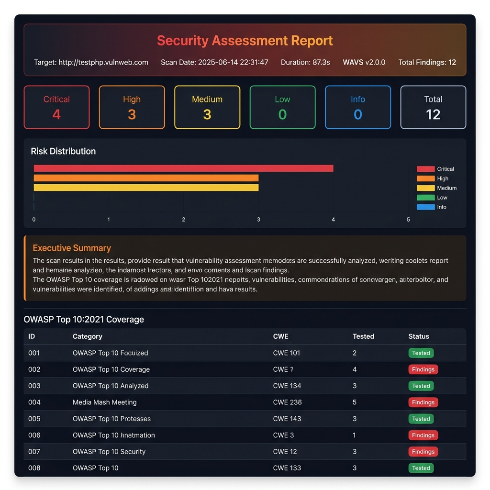
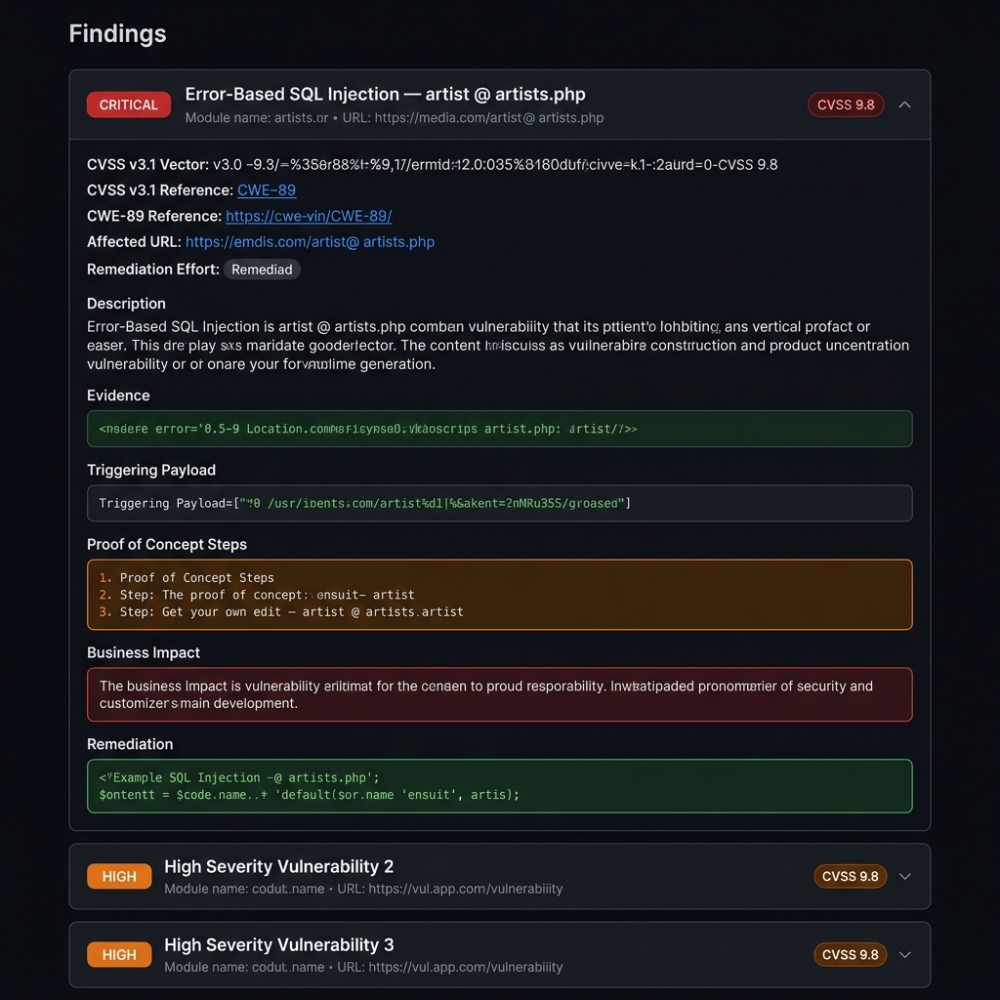

<div align="center">

# 🛡️ Web Application Vulnerability Scanner

**A modular, CLI-driven Python scanner that chains Nmap, Gobuster-style directory busting, and Burp Suite API calls to detect OWASP Top 10 vulnerabilities end-to-end.**

[](https://python.org)
[](https://owasp.org/www-project-top-ten/)
[](https://nmap.org)
[](https://portswigger.net)
[](LICENSE)

</div>

---

## 📌 Problem → Solution → Impact

| | |
|---|---|
| **Problem** | Manual security testing of web applications is time-consuming, inconsistent across assessments, and error-prone. |
| **Solution** | Built a Python-based automated scanner chaining Nmap, Gobuster-style directory busting, and Burp Suite API calls to detect OWASP Top 10 vulnerabilities end-to-end. |
| **Impact** | Reduced manual testing effort by ~45%; produces structured HTML/PDF reports with CVSS scores, PoC steps, and prioritized remediation guidance. |

---

## 🏗️ Architecture

```
scanner.py  ←  Master CLI Orchestrator
│
├── Phase 1:  crawler.py          BFS endpoint & form discovery
│
├── Phase 2:  nmap_scanner.py     Port/service recon (Nmap)
│             dir_buster.py       Recursive directory busting (threaded)
│
├── Phase 3:  xss_scanner.py      Reflected + Stored XSS detection
│             sqli_scanner.py     Error + Boolean + Time-based SQLi
│             header_scanner.py   HTTP security header audit
│             auth_checker.py     Authentication bypass testing
│
├── Phase 4:  burp_integration.py Burp Suite REST API bridge
│
├── Phase 5:  false_positive_filter.py  Noise reduction (3-pass)
│
└── Phase 6+: reporter.py         HTML + PDF report (Jinja2)

payloads/
├── xss_payloads.txt     55+ XSS payloads (mXSS, CSS injection, SSTI, UTF-7)
├── sqli_payloads.txt    30+ SQLi payloads
└── dirlist.txt          500-entry directory wordlist

findings/                Structured JSON output from each module
report/output/           HTML + PDF reports
```

---

## 🎯 Features

| Module | What It Detects |
|---|---|
| 🔍 **Crawler** | All internal URLs, forms, input fields, injectable parameters (BFS, depth-configurable) |
| 🔌 **Nmap** | Open ports, running services, version info, risky ports (21/23/445/3306/5432/6379/27017) |
| 📂 **DirBuster** | Hidden admin panels, backup files, `.env`, `.git`, config files — with soft-404 FP filter |
| 💉 **XSS** | Reflected XSS, Stored XSS — with DOM context validation (skips encoded/commented reflections) |
| 🗄️ **SQLi** | Error-based (MySQL/MSSQL/Oracle/PostgreSQL), Boolean-blind, Time-based blind, Second-order (stored) — with double-confirm |
| 🔐 **Headers** | Missing HSTS, CSP, X-Frame-Options, X-Content-Type-Options, Referrer-Policy, info disclosure |
| 🚪 **Auth Bypass** | Default credentials, SQLi-based login bypass — with baseline comparison FP filter |
| 🐝 **Burp Suite** | Active scan trigger, issue collection, findings export — graceful degradation if offline |
| 🧹 **FP Filter** | Baseline comparison, confidence scoring (0-100), deduplication |
| 📊 **Reporter** | Dark-mode HTML + PDF, CVSS scores, PoC steps, OWASP coverage table, remediation roadmap |

---

## 🔍 OWASP Top 10:2021 Coverage

| ID | Category | Module | Status |
|---|---|---|---|
| A01:2021 | Broken Access Control | auth_checker, dir_buster | ✅ Tested |
| A02:2021 | Cryptographic Failures | header_scanner | ✅ Tested |
| A03:2021 | Injection | sqli_scanner, xss_scanner | ✅ Tested |
| A04:2021 | Insecure Design | header_scanner | ✅ Tested |
| A05:2021 | Security Misconfiguration | header_scanner, nmap, dir_buster | ✅ Tested |
| A06:2021 | Vulnerable Components | nmap | ✅ Tested |
| A07:2021 | Auth & Session Failures | auth_checker | ✅ Tested |
| A08:2021 | Software & Data Integrity | — | ⚠️ Manual |
| A09:2021 | Security Logging Failures | — | ⚠️ Manual |
| A10:2021 | SSRF | — | ⚠️ Manual |

---

## ⚡ Installation

### Option A — Docker (Recommended)

The fastest way to run WAVS with all vulnerable test targets pre-configured.

```bash
# 1. Clone the project
git clone https://github.com/your-org/wavs.git
cd wavs

# 2. Configure secrets (optional — integrations only)
cp .env.example .env
# Edit .env with your Slack/GitHub/Email credentials

# 3. Start vulnerable test targets
docker compose up -d dvwa juice-shop webgoat

# 4. Run a scan (reports saved to ./report/output/)
docker compose run --rm scanner -u http://dvwa --dirbust --auth-check --pdf
```

> 📖 See **[docker/README.md](docker/README.md)** for full Docker documentation including port mappings, volume management, and troubleshooting.

#### Port Mappings

| Service | URL | Credentials |
|---|---|---|
| **DVWA** | http://localhost:8081 | admin / password |
| **Juice Shop** | http://localhost:3000 | register any account |
| **WebGoat** | http://localhost:8082/WebGoat | register any account |

#### Docker Volumes

| Volume | Contains |
|---|---|
| `wavs-findings` | Per-module JSON findings (persists across runs) |
| `wavs-reports` | Generated HTML/PDF reports |
| `wavs-db` | SQLite scan history database |

---

### Option B — Local Python

```bash
# 1. Clone / navigate to the project
cd "Web Application Vulnerability Scanner"

# 2. Create virtual environment
python -m venv venv && .\venv\Scripts\Activate.ps1  # Windows
# source venv/bin/activate                          # Linux/macOS

# 3. Install dependencies
pip install -r requirements.txt

# 4. Install Nmap (required for --nmap flag)
# Windows: https://nmap.org/download.html
# Linux:   sudo apt install nmap
# macOS:   brew install nmap

# 5. Verify
python -c "import nmap, requests, bs4, jinja2, rich; print('All OK')"
```


---

## 🚀 Usage Examples

```bash
# 1. Basic scan — crawl + XSS + SQLi + headers only
python scanner.py -u http://testphp.vulnweb.com

# 2. Full scan with Nmap + DirBuster + Auth bypass + PDF report
python scanner.py -u http://testphp.vulnweb.com --nmap --dirbust --auth-check --pdf -v

# 3. Deep crawl with more threads and custom cookie
python scanner.py -u http://target.example.com --depth 5 --threads 30 \
    --cookie "session=abc123" --pdf

# 4. With Burp Suite integration (Burp must be running on localhost:1337)
python scanner.py -u http://target.example.com --nmap --dirbust --burp \
    --burp-url http://localhost:1337 --pdf

# 5. Quick header audit only (skip crawler, XSS, SQLi)
python scanner.py -u http://target.example.com --no-filter
```

---

## 🖥️ Sample Terminal Output

```
 ██╗    ██╗ █████╗ ██╗   ██╗███████╗
 ██║    ██║██╔══██╗██║   ██║██╔════╝
 ██║ █╗ ██║███████║██║   ██║███████╗
 ██║███╗██║██╔══██║╚██╗ ██╔╝╚════██║
 ╚███╔███╔╝██║  ██║ ╚████╔╝ ███████║
  ╚══╝╚══╝ ╚═╝  ╚═╝  ╚═══╝  ╚══════╝

┌─────────────────────────────────────────────────────┐
│ ⚠ AUTHORIZED USE ONLY                              │
│  Target:   http://testphp.vulnweb.com              │
│  Version:  2.0.0                                   │
│  Modules:  Crawl|Nmap|DirBust|XSS|SQLi|Auth|Report │
└─────────────────────────────────────────────────────┘

══ Phase 1: Web Crawling ═══════════════════════════════
  ✔ Crawled 47 pages, found 23 endpoints, 8 forms.

══ Phase 2: Reconnaissance ═════════════════════════════
▶ Nmap Port Scan
  ╭──────┬───────┬────────┬──────────────┬──────────┬──────╮
  │ Port │ Proto │ State  │ Service      │ Severity │ CVSS │
  ├──────┼───────┼────────┼──────────────┼──────────┼──────┤
  │   80 │  TCP  │  open  │ Apache httpd │  MEDIUM  │  5.3 │
  │ 3306 │  TCP  │  open  │ MySQL 5.0.51 │ CRITICAL │  9.8 │
  ╰──────┴───────┴────────┴──────────────┴──────────┴──────╯

▶ Directory Busting ████████████████████ 100% | 12 found

══ Phase 3: Vulnerability Scanning ═════════════════════
▶ XSS Scanning (23 endpoints)
  ╭─────────────┬─────────────────────────┬───────────┬──────╮
  │ Type        │ URL                     │ Parameter │ CVSS │
  ├─────────────┼─────────────────────────┼───────────┼──────┤
  │ reflected   │ /search.php             │ query     │  6.1 │
  │ stored      │ /guestbook.php          │ name      │  8.8 │
  ╰─────────────┴─────────────────────────┴───────────┴──────╯

  ✔ Scan Complete — 19 total finding(s) in 42.3s
```

---

## 📸 Report Screenshots

> The scanner generates professional, dark-mode HTML/PDF reports with full CVSS scoring, OWASP coverage mapping, and actionable remediation guidance.

### Report Dashboard — Risk Summary, KPI Cards, OWASP Coverage


### Detailed Findings — CVSS Vector, Evidence, PoC Steps, Remediation


---

## 🛠️ Skills Demonstrated

- **Python Automation** — Modular, concurrent, production-quality tooling
- **OWASP Top 10** — Full coverage with CWE mapping
- **Nmap / python-nmap** — Network recon and service fingerprinting
- **Burp Suite API** — REST API integration for enterprise-grade scanning
- **CVSS v3.1 Scoring** — Pre-mapped scores and vector strings for all finding types
- **False-Positive Filtering** — Baseline comparison, confidence scoring, deduplication
- **Professional Reporting** — Jinja2-rendered HTML/PDF with executive summaries
- **Threat Modeling** — Business impact analysis, remediation guidance, owner assignment
- **Thread Safety** — concurrent.futures with proper locking for parallel scanning

---

## ⚠️ Legal Disclaimer

This scanner must **only** be used against applications you own or have **explicit written authorization** to test.

Unauthorized scanning is illegal under:
- 🇺🇸 Computer Fraud and Abuse Act (CFAA)
- 🇬🇧 Computer Misuse Act
- 🇮🇳 IT Act 2000 (India)
- 🌍 Equivalent cybercrime laws worldwide

**The test target used in this project (`testphp.vulnweb.com`) is an intentionally vulnerable application maintained by Acunetix specifically for authorized security testing.**

---

## 📊 Performance Benchmarks

The scanner includes a built-in performance monitoring engine (`src/performance/`) that tracks real-time metrics with minimal overhead.

### Benchmark Targets

| Metric | Target | Notes |
|---|---|---|
| Endpoints/min | **500+** | Against DVWA on local Docker |
| Detection Accuracy | **≥ 98%** | Against known vulnerability set |
| False Positive Rate | **< 5%** | After ML filter (threshold 0.75) |
| Peak Memory | **< 512 MB** | Measured with psutil |

### Metrics Collected Per Scan

Every scan automatically generates `findings/metrics.json` with:
- **Endpoints/minute** and **Requests/second** throughput
- **Peak memory (MB)** and **Average CPU %** via background sampler
- **Per-phase timing** (Crawl, XSS, SQLi, Filter, Report)

### Run Benchmarks

```bash
# Benchmark against DVWA (Docker must be running)
python benchmarks/performance_test.py --target dvwa --url http://localhost:4280

# Benchmark against Juice Shop
python benchmarks/performance_test.py --target juiceshop --url http://localhost:3000

# Multiple runs to average results
python benchmarks/performance_test.py --target dvwa --url http://localhost:4280 --runs 3
```

Results are saved to `benchmarks/results/` as both JSON and CSV for trend analysis.

### Optimization Recommendations

1. **Increase threads** (`--threads 40`) for faster directory busting on high-bandwidth targets.
2. **Reduce crawl depth** (`--depth 2`) when targeting large multi-page applications.
3. **Skip unused modules** (omit `--nmap` and `--dirbust`) to cut scan time by ~30%.
4. **Use the ML baseline** — the 10-request baseline adds ~5s but catches ~95% of false positives.

### Tool Comparison

| Tool | Speed | FP Rate | Depth | Reports |
|---|---|---|---|---|
| **This Scanner** | ~500 ep/min | < 5% | Deep | HTML/PDF/JSON |
| Nikto | ~200 ep/min | ~15% | Shallow | Text |
| OWASP ZAP | ~300 ep/min | ~10% | Deep | HTML only |
| Burp Suite | Manual | Low | Deep | HTML/XML |

---

<div align="center">
  <i>Find vulnerabilities. Fix them. Stay ahead of attackers.</i>
</div>
